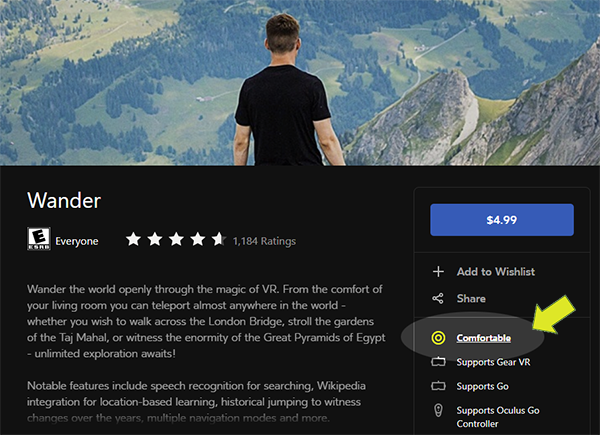

# VR-for-Seniors

Materials for demonstrating or teaching Virtual Reality and/or Augmented Reality to senior citizens

## Origin of the Materials
I am teaching a [hands-on introductory class](https://www.campusce.net/bc/course/course.aspx?C=15333&pc=1998&mc=&sc=) in Virtual Reality and Augmented Reality in the [Bellevue College TELOS program](https://www.bellevuecollege.edu/ce/retiree-programs/). TELOS is a program targeted at retirees, and my students have ranged from about 55 to about 85 years of age.

The three classes I have taught so far have gone very well and the students have enjoyed themselves, learned a lot, impressed their grandchildren, and made new friends.

I am sharing the class materials I have created to help other people who are developing VR experiences or VR classes for independent seniors or senior living residents.

## Materials Overview
  * **Documents-for-students/Class-Handout-1** -- This is the first-day handout that I print and give to the students. It has an overview of the course, shows the headsets and apps used in class, and has a page of links and book recommendations.
* **Reference-cards/Oculus Go Cards** -- These are two cards that help beginners get started with the Oculus Go. The first page shows the basics of the Go hardware and pages 2 and 3 are for their partner to help them find their way through the apps: Spinplay, Art Plunge, and Wander. I print these on cardstock with page 1 on one card and pages 2 and 3 on both sides of the second card.

#### I will be uploading more materials including lecture slides and more device and app reference cards after I have reviewed and modified them to insure they contain no copyrighted images.
#### Contact me at zocherclassgmail.com if you have questions or if you need access to these materials now.
## Approach of the Class
TELOS classes are informal but have deep content (e.g. Environmental Law is taught by a former EPA lawyer), so I have tried to give students a broad overview of the current state of VR and AR and have them experience a full sample of the current range of mainstream headsets and different kinds of available apps. The class also covers a little bit of technology and terminology.

Depending on your scope and objectives, you may want to ignore most of the lecture content.
## Assistants/Docents
It is important for VR beginners to be assisted and monitored while using VR. This is especially important for seniors (and young people). If you have assistants/docents for your class or program I recommend having one person assisting each VR user. [Here is a great example](https://www.siff.net/Documents/HR/2018/HR_VolunteerVRDocent_2018.pdf) of a job description for VR docents.
## Buddy System
If you don't have assistants or docents available and you're teaching a class, I recommend pairing up your students into teams of two for the duration of your class. I have used this approach in my classes, which I call the buddy system, and it has been very successful. The intensive student-to-student interaction required has also led to a strong sense of community/co-learning in my classes.

If you plan to try a buddy system it's necessary to clearly explain the responsibilites and importance to the students and to remind them in each class. The slides I used for this are here (TBD).

## Comfort 

The apps I selected for class minimize forward motion and the rated ones are all rated "Comfortable." So far students have had very few issues in my classes with no one experiencing motion sickness.

A few people have had balance reactions to the flying in Google Earth VR on the HTC Vive, but they've all slowed down and kept using it.

## Time in VR
The format of the class has each person using a headset for about 25 to 30 minutes per class meeting and helping their buddy for 25 to 30 minutes. I have had many students who wanted to keep going when their time was up and no one yet who was fatigued and wanted to stop early.  

## Safety
Some of the students with balance challenges have had their buddy hold one of thier elbows or place both on hands on their sholders to keep them straight when they are using standing VR.

I have all of the students use the Oculus Go sitting down and a couple of the students have been more comfortable trying the HTC Vive while seated.

The classrooms I've used have standard student chairs with a back rest and have wheels on all four chair legs. These are steady and are great for VR if you can get them. Based on my experience I would not use backless chairs or barstool height chairs with seniors.

## Recommendations
### For VR / AR Classes
The materials shared here are for a six hour class (4 meetings of 1 1/2 hours) where I spend 2 hours on lectures and 4 hours with the students using VR/AR. About 1/2 hour of the lecture material focuses on logistics and safety (e.g. the Buddy System) and I have pulled it out into a seperate presentation (TBD).

### For VR Exposure/Experience Programs
I have had the most success (and users have had the most enjoyment) across all age groups and technical abilities with the Oculus Go. Having a single controller is easier for beginning users and being seated for their first VR experiences is a comfortable way to start for all age groups.

If your objective is just to expose seniors to the joy and wonder of VR and/or have them engage in one or two specific experiences, then I strongly recommend focusing on the Oculus Go.

## Contact
If you are teaching or demonstrating VR to seniors and have questions or want to compare notes, you can contact me at zocherclassgmail.com.